# The Modern Data Stack

> **Transform your CSV data into a queryable, production-ready data lakehouse**

A comprehensive Go-based pipeline that converts CSV files into Apache Iceberg tables with automatic schema detection, powered by DuckDB and Trino.

## 🎯 What This Does

**Input**: Your CSV files  
**Output**: Queryable Iceberg data lakehouse with web-based SQL interface

```
CSV Files → Parquet → Iceberg Tables → Analytics
```

## 🚀 Quick Start (2 Minutes)

```bash
# 1. Clone and setup
git clone <your-repo>
cd the-modern-data-stack
just deps

# 2. Add your CSV files
cp your-data.csv data/source/

# 3. Run complete pipeline
just full-workflow

# 4. Query your data
just trino-cli
# Or visit: http://localhost:8080
```

## 📊 Architecture Overview

```mermaid
graph TB
    A[📁 CSV Files<br/>data/source/] --> B[🔄 CSV to Parquet<br/>DuckDB Converter]
    B --> C[📦 Parquet Files<br/>data/parquet/]
    
    C --> D[🧊 Iceberg Table Creator<br/>DuckDB Schema Inspector]
    D --> E[📊 Iceberg Tables<br/>data/iceberg_warehouse/]
    
    F[🐳 Docker Compose] --> G[🗄️ Iceberg REST Catalog<br/>localhost:8181]
    F --> H[🔍 Trino Query Engine<br/>localhost:8080]
    
    G --> E
    H --> E
    
    E --> I[📈 Analytics & Queries]
    C --> I
    
    I --> J[🦆 DuckDB<br/>Direct Parquet Access]
    I --> K[🔍 Trino Web UI<br/>SQL Interface]
    I --> L[📊 Business Intelligence<br/>Dashboards & Reports]
    
    style A fill:#e1f5fe
    style C fill:#f3e5f5
    style E fill:#e8f5e8
    style F fill:#fff3e0
    style I fill:#fce4ec
```



The pipeline automatically transforms your data through these stages:

**Stage 1: CSV → Parquet**
- Discovers all CSV files in `data/source/`
- Converts to efficient Parquet format using DuckDB
- Preserves data types and handles malformed files

**Stage 2: Parquet → Iceberg**
- Reads actual Parquet schemas using DuckDB
- Creates Iceberg tables with proper column types
- Preserves nullability and field metadata

**Stage 3: Query & Analytics**
- Trino web interface for SQL queries
- DuckDB for high-performance analytics
- Compatible with Spark, dbt, and BI tools

## 🐳 Services

| Service | URL | Purpose |
|---------|-----|---------|
| **Trino Web UI** | http://localhost:8080 | Interactive SQL queries |
| **Iceberg REST Catalog** | http://localhost:8181 | Metadata management |
| **DuckDB CLI** | `just query-iceberg <table>` | High-performance analytics |

## 📋 Commands

### **Main Workflow**
```bash
just full-workflow          # Complete CSV → Iceberg pipeline
just csv-to-parquet         # Convert CSV files to Parquet
just create-iceberg-tables  # Create Iceberg tables with schema inspection
```

### **Service Management**
```bash
just start-services         # Start Trino + Iceberg catalog
just stop-services          # Stop all services
just status-services        # Check service health
just logs [service]         # View service logs
```

### **Data Querying**
```bash
just trino-cli              # Interactive Trino SQL session
just query-trino "SQL"      # Run single SQL query via Trino
just query-iceberg <table>  # Query table via DuckDB
just query-parquet <file> "SQL"  # Query Parquet directly
```

### **Data Inspection**
```bash
just list-data              # Show all available data files
just describe-iceberg <table>  # Show table schema
```

## 🔧 Installation

### **Prerequisites**
- **Go 1.19+** (for building applications)
- **Docker** (for Trino + Iceberg services)
- **DuckDB** (optional, for direct querying)

### **Setup**
```bash
# Install dependencies
just deps

# Create data directories
just setup-data

# Build applications (optional)
just build
```

## 📁 Directory Structure

```
the-modern-data-stack/
├── cmd/
│   ├── csv_to_parquet/         # CSV → Parquet converter
│   └── create_iceberg_tables/  # Iceberg table creator
├── data/
│   ├── source/                 # Your CSV files (add here)
│   ├── parquet/                # Generated Parquet files
│   └── iceberg_warehouse/      # Iceberg table storage
├── etc/catalog/                # Trino catalog configurations
├── docker-compose.yml          # Service orchestration
├── justfile                    # Task automation
└── README.md
```

## 💡 Example Usage

### **Real Estate Data Analysis**

```bash
# 1. Add your data
cp transactions.csv data/source/
cp property_prices.csv data/source/

# 2. Process the data
just full-workflow

# 3. Analyze via Trino
just trino-cli
```

Then in Trino:
```sql
USE iceberg.my_data;
SHOW TABLES;
```

## 🤝 Contributing

1. Fork the repository
2. Create a feature branch
3. Make your changes
4. Run `just fmt` and `just test`
5. Submit a pull request

## 📚 Learn More

- **Apache Iceberg**: https://iceberg.apache.org/
- **Trino**: https://trino.io/
- **DuckDB**: https://duckdb.org/
- **Docker Compose**: https://docs.docker.com/compose/

---

**Built with ❤️ for modern data teams**
